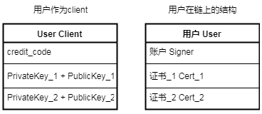
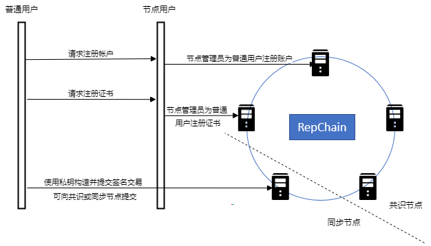

# RepChain中的术语

## 私钥

在[密码学](https://zh.wikipedia.org/wiki/密码学)中，[**密钥**](https://zh.wikipedia.org/wiki/%E5%AF%86%E9%92%A5)（key，又常称**金钥**）是指某个用来完成[加密](https://zh.wikipedia.org/wiki/加密)、[解密](https://zh.wikipedia.org/wiki/解密)、完整性验证等密码学应用的秘密[信息](https://zh.wikipedia.org/wiki/信息)。在[对称密码学](https://zh.wikipedia.org/wiki/对称密码学)（或称密钥密码学）中，加密和解密用的是同一个钥匙，因此钥匙需要[保密](https://zh.wikipedia.org/wiki/保密)。而在[公钥密码学](https://zh.wikipedia.org/wiki/公钥密码学)（或称非对称密码学）中，加密和解密用的钥匙不同：通常一个是公开的，称为**公钥**；另一个保密，称为**私钥**

## 用户账户 :id=account

 RepChain中账户模型为非utxo模型，使用用户的credit_code作为该用户的账户唯一标识

## 证书 :id=cert

包含用户的公钥，用来验签，标识用户身份，RepChain中一个用户有一个账户，可持有多个证书

## 创世块

区块链的第一个区块，在RepChain中，创世块内置了账户与证书管理合约，用户也可以自己使用`GenesisBuilder.scala`来编辑用来构建创世块的`genesis.json`文件

## 签名交易

使用私钥对交易内容签名，并将签名附加到交易内容之后形成签名交易，RepChain中签名交易分为三种类型

1. 部署合约的签名交易
2. 调用合约的签名交易
3. 修改合约状态的签名交易

## 智能合约

[**智能合约**](https://zh.wikipedia.org/wiki/%E6%99%BA%E8%83%BD%E5%90%88%E7%BA%A6)（英语：Smart contract）是一种特殊协议，在[区块链](https://zh.wikipedia.org/wiki/区块链)内制定合约时使用，当中内含了代码函数 (Function)。智能合约主力提供验证及运行合约内所订立的条件。[\[1\]](https://zh.wikipedia.org/wiki/智能合约#cite_note-1)智能合约允许在没有第三方的情况下进行可信交易。这些交易可追踪且不可逆转。

## 共识算法

节点是分布式的，所以必须有一套算法来维持各个节点账本的一致性。

## 节点   :id=node

使用p2p通信来组成区块链网络的计算机，组网节点分为共识节点与同步节点

* 共识节点

  > 参与组网共识、背书、出块

* 同步节点

  > 不参与组网共识、背书、出块，只同步区块或者接受用户提交的交易

## 用户  :id=user

可向**RepChain**提交交易的<u>**Client**</u>称为用户

- 组网节点用户

  参与RepChain组网的**节点（共识节点+同步节点）**的[证书](#cert)都可被RepChain记录识别，因此使用这些节点的私钥可作为Client构造签名交易向RepChain提交，RepChain可对这些签名交易进行验签

- 共识节点用户

  RepChain网络中的**共识节点**的[证书](#cert)都可被RepChain记录识别，因此使用这些节点的私钥可作为Client构造签名交易向RepChain提交，RepChain可对这些签名交易进行验签

* 同步节点用户

  RepChain网络中的**同步节点**的[证书](#cert)都可被RepChain记录识别，因此使用这些节点的私钥可作为Client构造签名交易向RepChain提交，RepChain可对这些签名交易进行验签

- 普通用户

  其[证书](#cert)需要被**管理员（组网节点用户）**注册到RepChain上之后，其作为Client使用自己的私钥构造的签名交易才可被RepChain验签通过，普通用户也分个人用户与机构用户，两者没有什么区别，类似2b或者2c

关系图如下：

