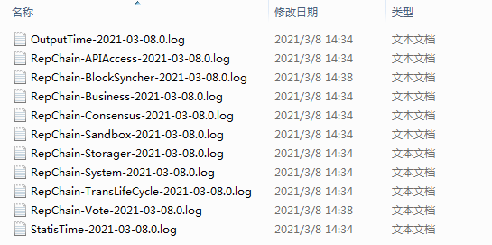

# 快速搭建RepChain开发环境

> 快速搭建开发环境，体验区块链
>


## 环境准备

> 需要一些基础环境和工具，如`Jdk`、`IntelliJ IDEA`

需要安装：

1. install [ZuluJdk11+](https://www.azul.com/downloads/zulu-community/?&architecture=x86-64-bit&package=jdk)

   > 建议使用`jdk13`，可使用idea来安装（<u>需要idea为较新的版本</u>）

2. install [Git](https://git-scm.com/downloads)

   > 小贴士：如果开发平台为`win7`可使用`GitBash`替换`cmd/powerShell`来作为常用终端

3. install [Idea](https://www.jetbrains.com/idea/download/#section=windows)

   1. install **scala plugin**

      > 1. 如果是**新装**idea，则在安装idea的时候，[将scala plugin勾选安装](https://www.jetbrains.com/help/idea/run-for-the-first-time.html#additional_plugins)
      > 2. 如果是**已有**idea，则在[ide中搜索scala plugin并安装](https://www.jetbrains.com/help/idea/managing-plugins.html#install_plugin_from_repo)

   2. install [sbt](http://www.scala-sbt.org/release/docs/Setup.html)（**可选**）

      > 如果安装了scala plugin则可在idea中使用[sbt shell](https://www.jetbrains.com/help/idea/sbt-support.html#sbt_shell)来编译RepChain，当然如果本步骤安装了sbt，也可以在终端下使用sbt来编译RepChain

**推荐IDE版本**：IntelliJ IDEA 2018(Ultimate Edition)版即可


## 开始搭建

假设目前想在目录`/project/`下进行合约开发或者体验RepChain，则可通过以下几种方式来快速搭建测试环境

* 终端命令行

  > 前提：jdk与sbt已经安装
  
  ```shell
  cd /project/
  git clone https://gitee.com/BTAJL/repchain.git
  cd repchain
  sbt clean compile
  # 修改conf/system.conf中给的contractOperationMode = 1
sbt run
  ```

* idea

  > 前提：jdk与scala plugin已经安装
  
  `File->New->Project from Version Control->Git.`后续使用sbt shell来执行clean compile等命令，使用`rep/app/RepChain.scala`作为主类入口，即可启动RepChain
  
* 使用[`tplDevelop`](https://gitee.com/BTAJL/repchain-tpldevelop)项目

  > 前提：jdk与scala plugin已经安装

  `tplDevelop`依赖`RepChain.jar`，并且将`RepChain.jar`的所有依赖的源码打包为`RepChain-sources.jar`，下载下来导入到Idea中即可开发合约，也可在idea中配置主类`rep.app.Repchain`运行RepChain进行测试，同时项目中，附有部署合约与调用合约的测试类，以及单元测试样例

!> <u>**注意的地方：**</u><br>在启动RepChain之前，需要根据需要修改[存储位置](v1.1.0/config.md#存储)，如果启动时出现磁盘不足的异常，可能有两种可能的原因：1、文件磁盘确实不足，修改配置文件`conf/system.conf`中`diskspaceManager`；2、可能是权限不足，用户在存储目录下不具有写权限


##  实时状态图

启动RepChain之后，可通过在浏览器中打开`localhost:8081/web/g1.html`查看实时图，实时图的端口可[配置](v1.1.0/config.md#系统)，通过实时图可以查看目前RepChain的工作状态，如果能打开实时图，且节点数目正确，也可证明区块链环境搭建成功（或者通过查询`localhost:8081/chaininfo`来确认是否有创世块，来判断是否成功）


## API接口

启动RepChain之后，可通过在浏览器中打开`localhost:8081/swagger/index.html`查看接口文档


**常用的API 如下：**

| API                                            | HTTP方法（GET/POST） | 说明                                                         |
| ---------------------------------------------- | :------------------- | ------------------------------------------------------------ |
| <b><font color=#000FF>block</font></b>         |                      | <b><font color=#000FF>block相关的API</font></b>              |
| /block/hash/{blockId}                          | GET                  | 根据blockHash                                                |
| /block/blockHeight                             | POST                 | 返回指定高度的区块                                           |
| /block/{blockHeight}                           | GET                  | 返回指定高度的区块                                           |
| /block/stream/{blockHeight}                    | GET                  | 返回指定高度的区块                                           |
| <b><font color=#000FF>chaininfo</font></b>     |                      | <b><font color=#000FF>链相关信息</font></b>                  |
| /chaininfo/node                                | GET                  | 返回组网节点数量                                             |
| /chaininfo                                     | GET                  | 返回块链信息                                                 |
| /chaininfo/getcachetransnumber                 | GET                  | 返回当前节点缓存池的交易数量                                 |
| <b><font color=#000FF>transaction</font></b>   |                      | <b><font color=#000FF>交易相关的API</font></b>               |
| /transaction/{transactionId}                   | GET                  | 根据交易Id获取交易                                           |
| /transaction/stream/{transactionId}            | GET                  | 根据交易Id获取交易                                           |
| /transaction/postTran                          | POST                 | <b><font color=#FF0000>IDE调试测试时用，以xml或json提交</font></b> |
| /transaction/tranInfoAndHeight/{transactionId} | GET                  | 返回指定id的交易信息及所在区块高度                           |
| /transaction/postTranByString                  | POST                 | 提交16进制字符串签名交易                                     |
| /transaction/postTranStream                    | POST                 | 提交带签名的交易字节流                                       |

**事件订阅**

客户端可通过webSocket来订阅RepChain的事件，如出块事件等，[区块同步工具](https://gitee.com/BTAJL/repchain-synchronizer)就是基于此

订阅url为`ws://ip:port/event`

## 日志

启动RepChain的时候，以`vm`参数传入，即：`-Dlogback.configurationFile=conf/logback.xml`



* 系统主要日志在BlockSyncher（节点同步）、Consensus（共识）、Vote（cfrd投票）、Sandbox（合约容器）、Storage（存储）、System

* 调试合约时，主要查看`Sandbox`与`Business`这两个类别的日志