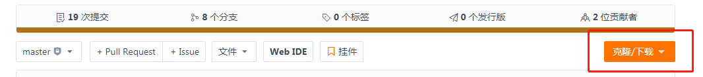

# [**RCJava-core**](https://gitee.com/BTAJL/RCJava-core)


## 项目介绍

Java SDK for RepChain，包括构造签名交易、提交签名交易、查询交易或块数据、同步块数据、订阅出块事件，及其他的一些工具类。签名交易包括三种类型：

1. 部署合约类型的交易；
2. 调用合约类型的交易；
3. 修改合约状态类型的交易。

****


## 目录结构

- src/main目录下
    ```
    com
      └── rcjava
          ├── client
          ├── exception
          ├── protos
          ├── sign
          ├── sync
          ├── tran
          ├── util
          └── ws
    ```
    * **`com.rcjava.client`** 主要用来构造与RepChain交互的客户端，客户端可以用来提交签名交易、获取交易或块数据、订阅出块事件

    * **`com.rcjava.exception`** 自定义的一些异常

    * **`com.rcjava.protos`** protoBuf generated messages

    * **`com.rcjava.sign`** 主要是加密相关的工具类，包括签名与Hash等

    * **`com.rcjava.tran`** 用来构建签名交易

    * **`com.rcjava.sync`** 用来同步区块数据

    * **`com.rcjava.tran`** 用来构建签名交易

    * **`com.rcjava.util`** 主要是封装了一些工具类<br>

        > - CertUtil 证书相关工具类
        > - KeyUtil  key操作相关的工具类
        > - PemUtil  Pem操作相关的工具类
        
    * **`com.rcjava.ws`** 利用websocket订阅块事件
- src/test
    * 主要是相关工具类的测试用例，用户可参考此示例代码来构造交易、提交交易以及使用相关工具类
    

***


## 安装教程

1. 项目基于MAVEN构建，需搭建好MAVEN环境

   * 若使用命令行，到[官网下载](https://maven.apache.org/download.cgi)

     

   * 使用IDE（[idea](https://www.jetbrains.com/idea/download/#section=windows)/[eclipse](https://www.eclipse.org/downloads/)）插件

     > 如果maven官方镜像仓库比较慢，请在settings.xml或pom.xml中配置镜像

2. jdk1.8+

   > 推荐使用[Zulu-Jdk](https://cn.azul.com/downloads/zulu-community/?architecture=x86-64-bit&package=jdk)

3. 下载项目

   - 如果没有安装[Git](https://git-scm.com/downloads)环境，直接download项目到本地开发环境中
   - 如果安装有[Git](https://git-scm.com/downloads)，使用命令git clone，clone项目到本地开发环境中

4. `mvn clean install` 打包rcjava-core为jar包，并install到本地maven仓库

5. 项目就可以引用rcjava-core了

   > ```xml
   > <dependency>
   > 	<groupId>repchain</groupId>
   > 	<artifactId>rcjava-core</artifactId>
   > 	<version>0.3</version>
   > </dependency>
   > ```

***

## 使用JitPack安装

* step1：

  ```xml
  <repositories>
  	<repository>
  		<id>jitpack.io</id>
  		<url>https://jitpack.io</url>
  	</repository>
  </repositories>
  ```

* step2：

  ```xml
  <dependency>
  	<groupId>com.gitee.BTAJL</groupId>
  	<artifactId>RCJava-core</artifactId>
  	<version>0.3</version>
  </dependency>
  ```


## 使用说明

* **准备工作**
  * 搭建好RepChain
  * 使用`secp256k1`生成密钥对，并向管理员（组网节点）申请注册账户和证书到RepChain

* 构建签名交易

  * 使用tran/impl下的具体类
    * InvokeTran

      ```java
      // 标识账户证书
      Peer.CertId certId = Peer.CertId.newBuilder()
          			.setCreditCode("121000005l35120456")
          			.setCertName("node1")
          			.build(); // 签名ID
      
      // 这个是给转账交易示范用的，此ID需要与repchain合约部署的一致
      Peer.ChaincodeId contractAssetsId = Peer.ChaincodeId.newBuilder()
          			.setChaincodeName("ContractAssetsTPL")
          			.setVersion(1)
         				.build();
      Transfer transfer = new Transfer("121000005l35120456", "12110107bi45jh675g", 5);
      
      // 合约方法参数
      Peer.ChaincodeInput chaincodeInput = Peer.ChaincodeInput.newBuilder()
                      .setFunction("transfer")
                      .addArgs(JSON.toJSONString(transfer))
                      .build();
      
      InvokeTran invokeTran = InvokeTran.newBuilder()
          			.setTxid("1234567890")
                      .setChaincodeInput(chaincodeInput)
                      .setCertId(certId)
                      .setChaincodeId(contractAssetsId)
                      .setPrivateKey(privateKey)
                      .setSignAlgorithm("SHA1withECDSA")
                      .build();
       Peer.Transaction transaction = invokeTran.getSignedTran();
      ```

    * CidStateTran

      > 参考InvokeTran的构建

    * DeployTran

      > 参考InvokeTran的构建

  * 使用TranCreator构建具体的交易

    * 构建InvokeTran

      ```java
      // 标识账户证书
      Peer.CertId certId = Peer.CertId.newBuilder()
          			.setCreditCode("121000005l35120456")
          			.setCertName("node1")
          			.build(); // 签名ID
      
      // 这个是给转账交易示范用的，此ID需要与repchain合约部署的一致
      Peer.ChaincodeId contractAssetsId = Peer.ChaincodeId.newBuilder()
          			.setChaincodeName("ContractAssetsTPL")
          			.setVersion(1)
         				.build();
      Transfer transfer = new Transfer("121000005l35120456", "12110107bi45jh675g", 5);
      // 合约方法参数
      Peer.ChaincodeInput chaincodeInput = Peer.ChaincodeInput.newBuilder()
                      .setFunction("transfer")
                      .addArgs(JSON.toJSONString(transfer))
                      .build();
      TranCreator tranCreator = TranCreator.newBuilder()
          			.setPrivateKey(privateKey)
          			.setSignAlgorithm("sha1withecdsa")
          			.build();
      Peer.Transaction tran = tranCreator.createInvokeTran(tranId, certId, contractAssetsId, "transfer", JSON.toJSONString(transfer));
      ```
      
    * CidStateTran
    
      > 参考InvokeTran的构建
    
    * DeployTran
    
      > 参考InvokeTran的构建

* 提交签名交易

  * 使用**同步**方式

    > 用来提交签名交易的客户端：TranPostClient 
    >
    > ```java
    > public JSONObject postSignedTran(String tranHexString) {/***/}
    > public JSONObject postSignedTran(Transaction tran) {/***/}
    > ```

    

  * 使用Hex字符串的方式

      ```java
      TranPostClient tranPostClient = new TranPostClient("localhost:8081");
      // -------------------------------
          /****构建签名交易 Transaction tran ****/
      // -------------------------------
      String tranHex = Hex.encodeHexString(tran.toByteArray());
      JSONObject res = tranPostClient.postSignedTran(tranHex);
      ```

      

  * 使用字节块提交

      ```java
      TranPostClient tranPostClient = new TranPostClient("localhost:8081");
      // -------------------------------
          /****构建签名交易 Transaction tran ****/
      // -------------------------------
      JSONObject res = tranPostClient.postSignedTran(tran);
      ```
      

    

  * 使用**异步**方式

    > 用来异步提交签名交易的客户端：TranPostAsyncClient
    >
    > ```java
    > public Future<HttpResponse> postSignedTran(String tranHexString) {/***/}
    > public Future<HttpResponse> postSignedTran(Transaction tran) {/***/}
    > ```

    * 使用<u>Hex字符串</u>的方式

      ```java
      TranPostAsyncClient tranPostClient = new TranPostAsyncClient("localhost:8081");
      // -------------------------------
          /****构建签名交易 Transaction tran ****/
      // -------------------------------
      String tranHex = Hex.encodeHexString(tran.toByteArray());
      Future<HttpResponse> responseFuture = tranPostClient.postSignedTran(tranHex);
      ```

    * 使用<u>字节块</u>提交

      ```java
      TranPostAsyncClient tranPostClient = new TranPostAsyncClient("localhost:8081");
      // -------------------------------
          /****构建签名交易 Transaction tran ****/
      // -------------------------------
      Future<HttpResponse> responseFuture = tranPostClient.postSignedTran(tran);
      ```

    * 从future中解析数据，默认超时时间20s

      > ```java
      > HttpResponse httpResponse = responseFuture.get(20, TimeUnit.SECONDS);
      > ```
      
      ```java
      JSONObject result = TranPostAsyncClient
          		.resolveHttpResponseFuture(responseFuture);
      ```

* 查询交易数据

  > 使用ChainInfoClient构建查询客户端，用来获取链信息的客户端

  ```java
  ChainInfoClient chainInfoClient = new ChainInfoClient("localhost:8081");
  String txid = "1234567890";
  // 使用Json构建
  Transaction tran = chainInfoClient.getTranByTranId(txid);
  // 直接获取字节块构建
  Transaction tran = chainInfoClient.getTranStreamByTranId(txid);
  ```

  

* 查询块数据

  > 使用ChainInfoClient构建查询客户端

  ```java
  ChainInfoClient chainInfoClient = new ChainInfoClient("localhost:8081");
  BlockchainInfo blockchainInfo = chainInfoClient.getChainInfo();
  // 使用Json构建
  Block block = chainInfoClient.getBlockByHeight(5);
  // 直接获取字节块构建
  Block block = chainInfoClient.getBlockStreamByHeight(5)
  
  ```

* 查询其他数据

  > 使用ChainInfoClient构建查询客户端

  ```java
  ChainInfoClient chainInfoClient = new ChainInfoClient("localhost:8081");
  // 使用具体方法即可，如根据交易ID查询交易以及交易所在区块高度：
  ChainInfoClient.TranInfoAndHeight tranInfoAndHeight = chainInfoClient
      			.getTranInfoAndHeightByTranId("1234567890");
  ```

  

* 同步块数据

  > 使用sync/SyncService构建同步服务，从指定高度开始同步，一直到最新高度
  >
  > 1. 使用host、syncInfo、syncListener、syncEndPoint初始化Service
  >
  >    > **注意**两个接口SyncListener与<u>SyncEndPoint</u>（**用来错误修正** >>> 因RepChain块回滚或意外宕机导致的落盘失败而引起的区块衔接不上），具体说明参考JavaDoc与Test用例<br>
  >    >
  >    > * SyncEndPoint包含两个方法：
  >    >
  >    >   1.  根据高度查询数据库中已保存的块Hash
  >    >
  >    >   2.  更新数据库中从高度`localLastCorrectHeight`到`currentRemoteHeight`的相关数据
  >    >
  >    >      > 高度为currentRemoteHeight的数据块是从RepChain新拉取的
  >    >
  >
  > 2. 初始化之后，就可以start了，服务需要挂起

  ```java
  SyncInfo syncInfo = new SyncInfo(locHeight, locBlkHash);
  
  SyncService syncService = SyncService.newBuilder()
  			.setHost("localhost:8081")
              .setSyncInfo(syncInfo)
              .setSyncListener("SyncListener实例")
      		.setSyncEndPoint("SyncEndPoint实例")
              .build();
  Thread thread = new Thread(syncService::start);
  thread.start();
  ```

  

* 订阅块事件

  > 使用client/RSubClient构建客户端，使用观察者模式
  >
  > 1. 创建BlockObserver实例
  > 2. 创建BlockListener实例（可使用工具类BlockListenerUtil获取-->每个host只有唯一的1个listener）
  > 3. 向BlockListener中注册BlockObserver
  
  ```java
  // 获取block监听，使用 host 获取一个监听，每个 host 对应一个监听
  // 也可以自己去实例化
  blkListener = BlockListenerUtil.getListener(host);
  // event 监听，并回调给具体的实现类
  blkListener.registerBlkObserver("BlockObserver实例");
  RSubClient rSubClient = new RSubClient(host, blkListener);
  rSubClient.connect();
  ```
  