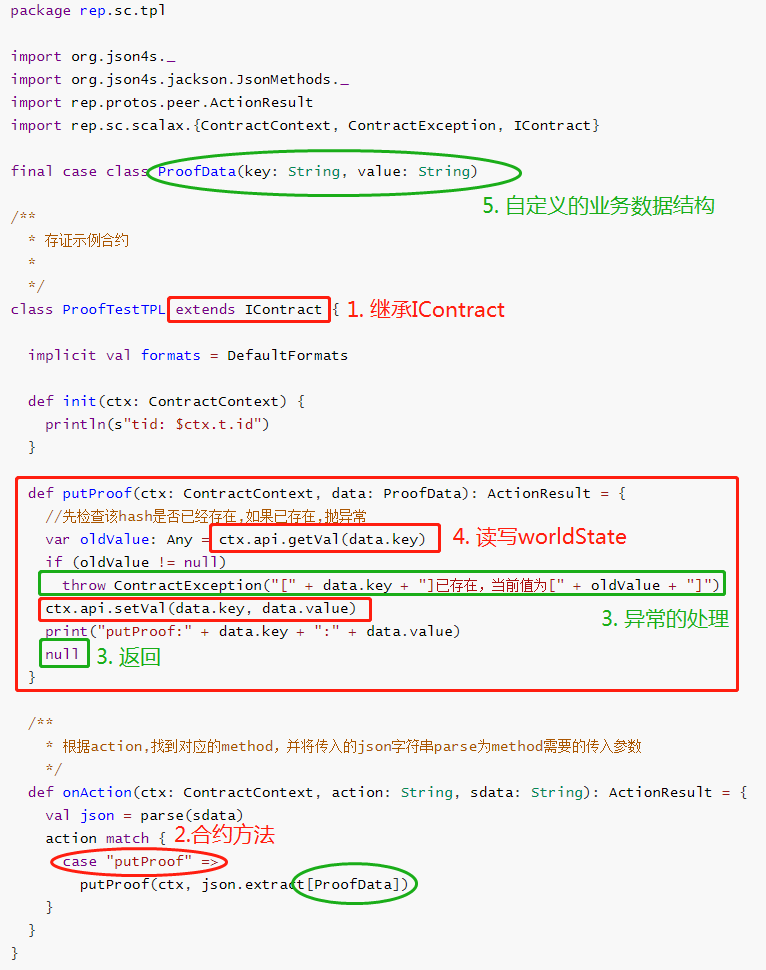
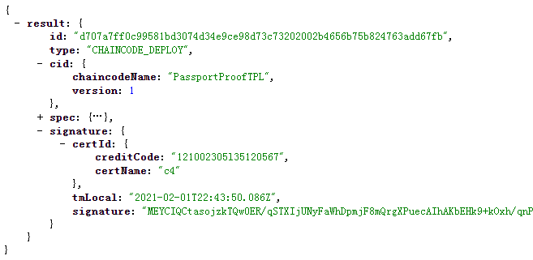
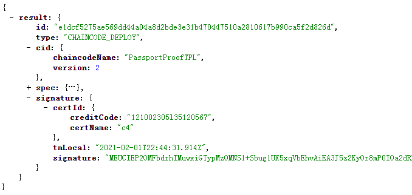
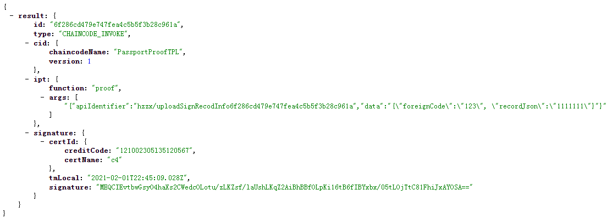
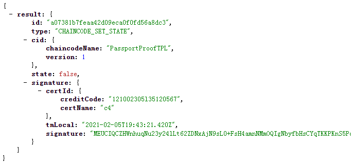

## 合约开发

?> 详细的开发或测试RepChain合约的步骤，可参考[开发教程](http://btajl.gitee.io/repchain-tpldevelop/#/)

* 开发语言
  
  * `Scala`
  
* 底层接口

  提供给合约开发者的关于读写`worldstate`（底层使用LevelDb）相关的`API`如下：

  | API                                                | 说明                               |
  | -------------------------------------------------- | ---------------------------------- |
  | ctx.api.setVal(key: String, value: Any)            | 保存key-value                      |
  | ctx.api.getVal(key: String): Any                   | 获取key对应的value                 |
  | ctx.api.setState(key: String, value: Array[Byte])  | 保存key-value                      |
  | ctx.api.getState(key: String, value) : Array[Byte] | 获取key对应的value                 |
  | getStateEx(cName:String, key: String): Array[Byte] | 跨合约去读key对应的value           |
  | **getLogger: Logger**                              | 获取一个日志Logger，可用来记录日志 |
  | bNodeCreditCode(credit_code: String)               | 判断该交易的提交者是否是管理员     |

  !> 1. **注意上面value的类型**<br>2. 合约是状态隔离的，**不可以**跨合约写，允许跨合约读

* 异常处理

  合约方法中，如果有错直接`throw  ContractException("message")`，如果没有错误，则返回`null` 

* [开发规范](https://gitee.com/BTAJL/RepChain_Linter)

  * 合约类继承自`IContract`，并且不能继承或实现其他接口
  * 在读写state时，不能引入随机数
  * 在读写state时，不能引入`LocalDateTime`
  * case class中字段不要使用Any类型
  * 在`import`类的时候，要使用全路径

* 示例代码：

  

  ?> 

## 合约测试

使用IDE进行断点调试或单元测试，参考[详细内容](http://btajl.gitee.io/repchain-tpldevelop/#/v1.1.0/contract_test)

### 断点调试

* xml方式

  > 通过`swagger-ui`+`xml`的方式，使用swagger-ui上的`/transaction/postTran`的接口

  1. 首先打开localhost:8081/swagger/index.html，在`postTran`接口处部署合约，使用下面的xml进行部署

     ```xml
     <?xml version="1.0" encoding="UTF-8"?>
     
     <!--该用例主要是部署同样的合约，并验证返回值（存在重复的合约Id）-->
     <CSpec>
         <stype>1</stype>
         <chaincodename>PassportProofTPL</chaincodename>
         <chaincodeversion>1</chaincodeversion>
         <iptFunc></iptFunc>
         <iptArgs></iptArgs>
         <timeout>0</timeout>
         <legal_prose></legal_prose>
         <code>
         	<![CDATA[
     package rep.sc.tpl
     
     import java.nio.charset.StandardCharsets
     import java.security.MessageDigest
     
     import org.json4s.jackson.JsonMethods.parse
     import org.json4s.{DefaultFormats, MappingException}
     import rep.crypto.BytesHex
     import rep.protos.peer.ActionResult
     import rep.sc.scalax.{ContractContext, ContractException, IContract}
     
     /**
       * 物流上链数据
       *
       * @param apiIdentifier 接口标识
       * @param data          要存证的数据
       */
     case class PassportData(apiIdentifier: String, data: String)
     
     /**
       * @author zyf
       */
     class PassportProofTPL extends IContract {
     
       implicit val formats: DefaultFormats.type = DefaultFormats
     
       val sha256Digest: MessageDigest = MessageDigest.getInstance("SHA-256")
     
       override def init(ctx: ContractContext): Unit = {
         println(s"tid: $ctx.t.id")
       }
     
       /**
         * 存证
         *
         * @param ctx
         * @param data 护照链上传的数据
         * @return
         */
       def proof(ctx: ContractContext, passportData: PassportData): ActionResult = {
         val prefix = passportData.apiIdentifier
         val infix = "_"
         val suffix = BytesHex.bytes2hex(sha256Digest.digest(passportData.data.getBytes(StandardCharsets.UTF_8)))
         val key = prefix + infix + suffix
         ctx.api.setVal(key, passportData.data)
         null
       }
     
       override def onAction(ctx: ContractContext, action: String, sdata: String): ActionResult = {
     
         val jsonData = parse(sdata)
     
         action match {
     
           case "proof" =>
             try {
               val data = jsonData.extract[PassportData]
               proof(ctx, data)
             } catch {
               case mapEx: MappingException => throw ContractException(mapEx.getMessage)
             }
     
           case _ => throw ContractException(s"合约中没有对应的方法${action}")
         }
       }
     }
     		
     		]]>
         </code>
         <ctype>2</ctype>
         <state>true</state>
     </CSpec>
     ```

  2. 在src/main/scala下会生成`SC_PassportProofTPL_1.scala`文件

  3. 重启RepChain

  4. 在`SC_PassportProofTPL_1.scala`文件的相应源码处打上断点

  5. 调用合约来测试

   ```xml
    <?xml version="1.0" encoding="UTF-8"?>
    
    <!--该用例主要是测试正确转账（并且未超出余额），并验证返回值-->
    
    <CSpec>
        <stype>2</stype>
        <chaincodename>PassportProofTPL</chaincodename>
        <chaincodeversion>1</chaincodeversion>
        <iptFunc>proof</iptFunc>
        <iptArgs>
            {
              "apiIdentifier" : "353453554353453453",
              "data" : "{\"foreignCode\":\"123\", \"recordJson\":\"1111111\"}"
            }
        </iptArgs>
        <timeout>0</timeout>
        <legal_prose></legal_prose>
        <code></code>
        <ctype>2</ctype>
        <state>true</state>
    </CSpec>
   ```

  

* sdk方式

  > RCJava-core等sdk来构建交易，提交到RepChain

  1. 使用sdk部署合约
  2. 在src/main/scala下会生成`SC_PassportProofTPL_1.scala`文件
  3. 重启RepChain

  4. 在`SC_PassportProofTPL_1.scala`文件的相应源码处打上断点

  5. 使用sdk调用合约来测试

* 命令行工具

  1. 使用命令行工具部署合约
  2. 在src/main/scala下会生成`SC_PassportProofTPL_1.scala`文件
  3. 重启RepChain

  4. 在`SC_PassportProofTPL_1.scala`文件的相应源码处打上断点

  5. 使用命令行工具提交调用合约的交易来测试

### 合约单元测试

- 使用`scalaTest`与`akkaTestkit`
- 测试用例的编写可参考`src/test/scala/rep/sc`目录下的测试用例


## 生命周期

RepChain对合约有着完整生命周期管理，分为<u>部署/升级</u>、<u>调用</u>以及<u>禁用/启用</u>，对应于RepChain中**三种类型签名交易**：<u>deploy</u>、<u>invoke</u>以及<u>setState</u>，向RepChain

* 部署/升级

  [用户](v1.1.0/term.md#user)编写好合约，通过构造并提交部署类型的签名交易，将合约部署到RepChain上，此后，该用户可以合约进行升级操作，如已部署的Contract_A版本号为1，可升级合约Contract_A版本为2 ... 3 ... N，使用`deploy`类型的签名交易来部署/升级合约

       

  上面两张图，左边是部署合约的签名交易，右边是升级合约的签名交易，可以看到`type`都为`Deploy`类型


* 调用

  合约部署后，RepChain的[用户](v1.1.0/term.md#user)即可调用该合约，使用`invoke`类型的签名交易来调用执行合约

   

  从上图可以看出，`type`为`Invoke`类型

* 禁用/启用

  合约的部署者，可对其已部署的合约做禁用/启用操作，使用`setState`类型的签名交易来禁用/启用合约
  
  
  
  从上图可以看出，`type`为`setState`类型