# RepChain部署

* RepChain所支持的网络环境

  支持局域网、专网、公网部署，`NAT`或`docker`环境

* RepChain所支持的软硬件环境

  硬件环境：x86-64、Arm-64（如：鲲鹏服务器、树莓派）、RISK-V；软件环境：虚拟机、Docker

* 部署和运行RepChain节点的方式

  使用`jar`包部署，运行在JVM上（jdk11+，推荐jdk13+），基于JAVA的跨平台部署，RepChain支持部署在绝大部分的Windows、Linux与MacOS系统上
  
* RepChain的部署模式

  > 可以分为单机模拟多节点、分布式多机多节点部署

  * **单机模拟多节点**

    可以理解为一个进程中运行多个线程（节点），运行在同一宿主机上，一般在开发测试环境中使用该部署方式，用来测试RepChain代码或编写好的合约

  * **分布式多机多节点**

    可以理解为每个节点是一个进程，各个节点分别部署在不同的宿主机上

## 编译打包

* 环境需求：

  1. 硬件的推荐配置：CPU：4核，Memory：8G，Disk：100G

     > 所述配置是推荐的**基础运行环境**的硬件配置，打包编译环境的配置可降低（可根据实际情况进行降低或提升配置）

  2. Java环境：Jdk-13，推荐[Azul-zuluJdk](https://www.azul.com/downloads/?version=java-13-mts&architecture=x86-64-bit&package=jdk)，也可使用[Oracle-Jdk](https://www.oracle.com/java/technologies/downloads/archive/)

  3. 操作系统：可以安装Jdk-13的系统

  4. 支持架构：x86-64、Arm-64（如：鲲鹏服务器、树莓派），目前也支持：RISC-V；如果是Arm-64架构，则需要替换RepChain代码默认所依赖的leveldbjni的包，替换方式参见后续的介绍

  5. [Git](https://git-scm.com/downloads)：用来下载RepChain的源码（非必须，可直接下载[压缩包](https://gitee.com/BTAJL/repchain/repository/archive/RepChain_1.1.0_RC)）

  6. 编译工具：[Sbt](https://www.scala-sbt.org/download.html) ，安装方式见[官方教程](https://www.scala-sbt.org/1.x/docs/Setup.html)；<font color=#FF0000 >或</font> 安装了[Scala](https://plugins.jetbrains.com/plugin/1347-scala/versions/stable)插件的[IDEA](https://www.jetbrains.com/idea/download/#section=mac)，插件安装方式见[官方教程](https://www.jetbrains.com/help/idea/managing-plugins.html#required-plugins)

* 下载源码：

  1. 如果有安装Git，且为Git配置了系统环境变量，则使用GitBash或者系统自带Terminal，依次输入如下命令：

     ```bash
     git clone https://gitee.com/BTAJL/repchain.git
     cd repchain
     git fetch
     git checkout -b rc_1.1.0 RepChain_1.1.0_RC
     ```
  
     > 如不使用git，也可以直接下载[压缩包](https://gitee.com/BTAJL/repchain/repository/archive/RepChain_1.1.0_RC)，并解压为repchain
  
  2. 找到repchain根目录下的build.sbt文件，修改build.sbt中的`mainClass`（Jar包主类），如果部署模式为[单机模拟多节点](#单机模拟多节点)，则修改为`rep.app.Repchain`，如果部署模式为[分布式多机多节点](#分布式多机多节点)，则修改为`rep.app.Repchain_Single`，如下所示：
  
     ```shell
     # 单机模拟多节点
     mainClass in (Compile, packageBin) := Some("rep.app.Repchain")
     # 或
     # 分布式多机多节点
     mainClass in (Compile, packageBin) := Some("rep.app.Repchain_Single")
     ```
  
     !> RepChain默认使用的`leveldbjni`包不支持Arm-64，因此如果要将RepChain部署在Arm-64架构的服务器，需要将根目录下的build.sbt文件中配置的`leveldb-jni`依赖包替换（可以自己根据`leveldb-jni`的说明文档自行编译），如下所示：
  
     ```shell
     # 将
     libraryDependencies += "org.fusesource.leveldbjni" % "leveldbjni-all" % "1.8"
     # 替换为
     libraryDependencies += "com.github.huangtianhua" % "leveldbjni-linux64-aarch64" % "1.9"
     # 或
     libraryDependencies += "org.openlabtesting.leveldbjni" % "leveldbjni-linux64-aarch64" % "1.8"
     ```
  
  3. 编译并打包
  
     > 有两种方式，一种是在IDEA中使用`sbt-shell`（安装了Scala插件后，即可使用该工具），另一种是在终端使用`sbt-repl`（安装了Sbt后，即可使用该工具），详细说明过程可参考后面的打包演示：
  
     * 方式一：在IDEA中打开`sbt shell`并进入交互界面后，依次输入如下命令：clean->compile->assembly，如下所示：
  
       ```shell
       sbt:RepChain> clean 
       sbt:RepChain> compile 
       sbt:RepChain> assembly
       ```
  
     * 在终端中使用`sbt-repl`，输入`sbt`命令进入交互界面后，依次输入如下命令：
  
       ```shell
       > clean 
       > compile 
       > assembly
       ```
  
  4. 打包好的RepChain.jar存放在`repchain/target/scala-2.12/RepChain.jar`
  
* 打包过程演示：

  1. 使用IDEA中的`sbt-shell`

     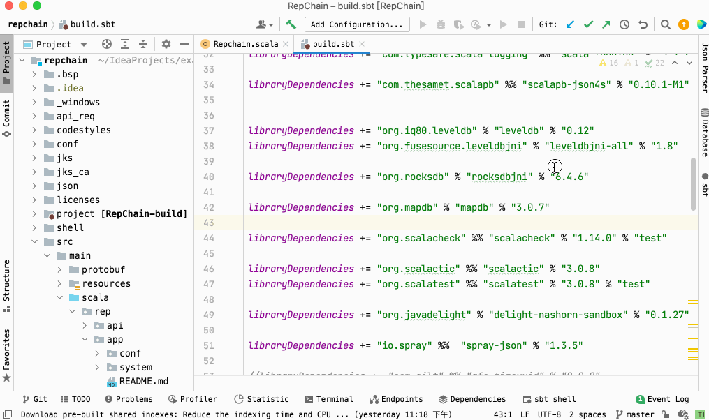

  2. 使用终端（Terminal or cmd），下面以mac下的终端为例（Windows或Linux类似）

     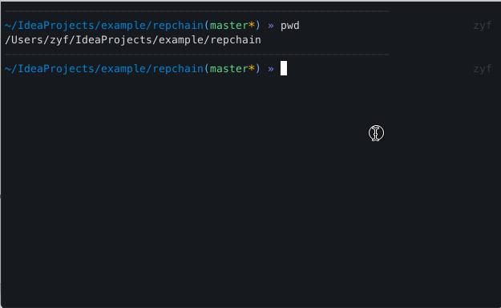

## 部署

在上一小节中，主要叙述了如何对RepChain的源码进行了编译并打包得到RepChain.jar，接下来使用RepChain.jar来部署RepChain网络，RepChain的部署有两种方式：一是单机模拟多节点；二是分布式多机多节点。接下来分别做详细介绍

### 单机模拟多节点

> 默认RepChain使用单机模拟**5**节点，一般在开发测试环境中使用该部署方式，主要目的是用来测试RepChain代码或者编写好的合约，在同一个`Jvm`上模拟启动5个节点，启动主类为`rep.app.Repchain`

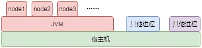

* 环境需求：
  
  1. 硬件的基础配置：CPU：4核，Memory：8G
  2. Java环境：Jdk-13，推荐[Azul-zuluJdk](https://www.azul.com/downloads/?version=java-13-mts&architecture=x86-64-bit&package=jdk)，也可使用[Oracle-Jdk](https://www.oracle.com/java/technologies/downloads/archive/)
  
* 配置文件

  > RepChain的配置文件为repchain/conf/system.conf

  * `system.conf`中需要注意的配置项
    1. `system.httpServicePort` = 8081，RepChain的http服务的端口
    2. `system.contractOperationMode = 1`,以`jar`包模式运行RepChain，该配置项须改为 **1**
    3. `system.trans_create_type=0` ，接受从API提交过来的交易（如果设置为1，代表的是节点自动产生并提交交易，主要是用来测试用）
    4. `sytetem.storage.dbpath `，leveldb存储位置
    5. `sytetem.storage.blockpath `，block的文件存储位置

* 启动方式为在终端下输入命令：

  ```shell
  # 先前在打包环节已经指定了主类
  java -jar RepChain.jar
  ```

  或

  ```shell
  # 指定主类
  java -cp RepChain.jar rep.app.Repchain
  ```

* 启动成功标志有两种验证方式

  - 过API接口来验证。在浏览器中输入`http://localhost:8081/chaininfo/node`，如果返回结果中nodes数量为目前组网节点数量，则表示成功；或者是在终端中输入`curl http://localhost:8081/chaininfo/node`，如果返回结果中nodes数量为**目前组网节点数量**，则表示成功

    
  
* 在浏览器中输入`http://localhost:8081/web/g1.html`，如果出现如下界面，可以看到如下图所示，红框中可以看到入网的节点，则标识成功
  
  

*  **可能出现的问题**
  
  * leveldbjni相关的错误，在windows下可能是没有c++环境导致的，装[Microsoft Visual C++ 2010 x64 Redistributable](https://docs.microsoft.com/en-us/cpp/windows/latest-supported-vc-redist?view=msvc-170#visual-studio-2010-vc-100-sp1-no-longer-supported)即可
  * 磁盘空间不足的错误，有如下两个可能的原因：
    1. 确实是磁盘空间不足，修改system.conf中的配置项`diskspaceManager.diskspacealarm`
    2. 用户权限不够，即用户不具有在所配置存储目录下的读写的权限。
  
* 其他：如果想要在同一个JVM上模拟启动大于5个节点，即单机模拟6~N节点，启动主类可使用`rep.app.RepChain_Multi`

  * 准备工作

    `jks`目录下相应的节点密钥对与证书应是6~N个，仿照原有jks文件放置新生成的jks文件即可，可使用[Kse](https://keystore-explorer.org/)或者[代码](https://gitee.com/BTAJL/repchain-tpldevelop/blob/master/src/main/scala/rep/jks/genjks/GenerateJks.java)来生成节点密钥对和自签名证书，并将证书导入mytruststore.jks中，注意Jks文件名，以及其中存储的密钥对或者证书的别名，`***.nodex`，下图是Kse的简单使用示例

    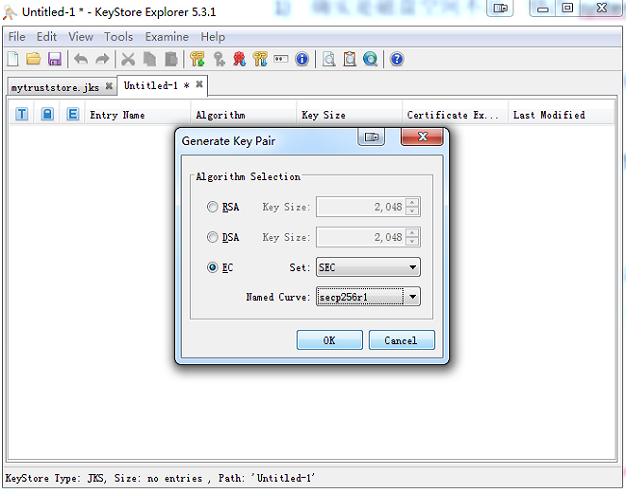

    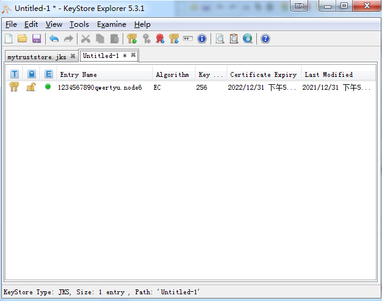

    !> 注：其中mytruststore.jks中存放了网络内所有节点的证书，如下图：

    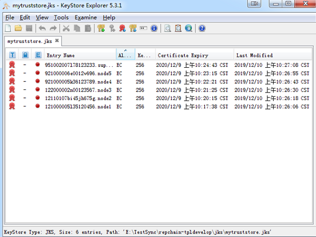

  * 启动方式

    * 在终端输入命令

      > 请查看源码`src/main/scala/rep/app/RepChain_Multi.scala`

      ```shell
      java -cp RepChain.jar rep.app.RepChain_Multi N-1
      ```

* <strong><font color=#FF0000>jar包部署后（单机5节点）的目录类似下图，6~N节点类似：</font></strong>

  > 注：其中mytruststore.jks中存放了网络内所有节点的证书
  
  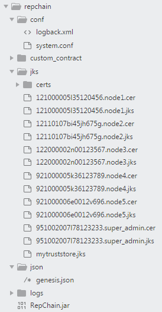

### 分布式多机多节点

> 分布式多机多节点与单机多节点部署的原理是相同的，区别在于多机多节点是分别在不同服务器上部署RepChain.jar，然后组网连接成为分布式区块链网络。同一个`Jvm`上启动1个节点，启动主类为`rep.app.Repchain_Single`


- 网络部署及启动方式

  - 可跨域、跨云进行去中心化部署，也可在专线、政务云上进行部署，单台服务器作为一个节点，节点服务器被各个机构各自维护

  - 启动方式以node1、node2的为例

    - 在node1所在主机的终端下输入命令：

      ```shell
      java -jar RepChain.jar "121000005l35120456.node1" 
      # 或指定主类
      java -cp RepChain.jar rep.app.Repchain_Single "121000005l35120456.node1"
      ```

    - 在node2所在主机的终端下输入命令：

      ```shell
      java -jar RepChain.jar "12110107bi45jh675g.node2" 
      # 或指定主类
      java -cp RepChain.jar rep.app.Repchain_Single "12110107bi45jh675g.node2"
      ```

- ip与port的配置参考[相关配置](v1.1.0/config.md)

  * 非**NAT**或非**docker**环境下使用如下配置（hostname为主机IP，port为节点之间P2P通信端口），修改`conf/system.conf`如下：

    ```json
    remote {
    	#artery模式下的配置，设置的是自己节点的地址和端口
        artery {
          	canonical.hostname = "192.168.2.136"  	# 局域网ip
          	canonical.port = 8082				    # 通信端口，可自由指定
        }
    }
    ```

    下面列举5节点网络中的3个节点的端口配置情况（种子节点\<seed-nodes\>处配置3个即可，注意对应种子节点所配置的通信端口），其他节点的端口配置类似（其他节点主要是修改自己的`hostname`与`port`）

    !> **注**：种子节点指的是在网节点，如果创世节点启动，那么其种子节点配置项\<seed-nodes\>配置自己的ip和port即可，如果是其他节点想要加入已经存在的网络，那么其种子节点的配置项\<seed-nodes\>需要配置已经在网络中的节点的ip和端口

    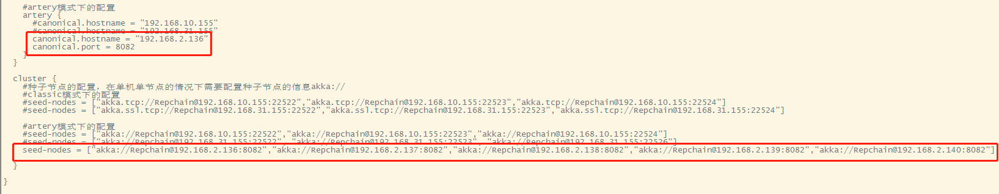

    

    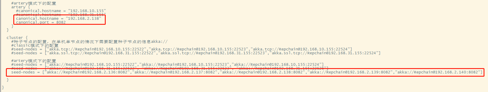

  * **NAT**环境使用如下配置，针对上述图形中的artery部分修改即可，然后将种子节点设为相应节点的外部地址，修改`conf/system.conf`如下：

    ```json
      remote {
      	#artery模式下的配置，设置的是自己节点的地址和端口
          artery {
              canonical.hostname = "139.10.1.3"  	# 外部地址
              canonical.port = 8082				    # 外部端口
              bind.hostname = "192.168.2.136"		# 局域网地址
              bind.port = 8082					    # 局域网端口
          }
      }
    ```

    下面列举5节点网络中的**3**个节点的端口配置情况（种子节点处这里配置了**1**个），其他节点的端口配置类似（其他节点主要是修改自己的**内部或外部**的`hostname`与`port`）

    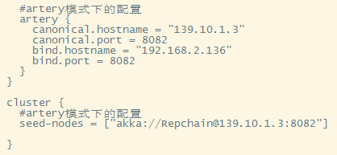

    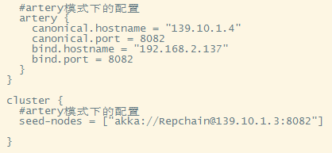
    
    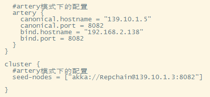

- <strong><font color=#FF0000>jar包部署后（分布式多机多节点）的目录类似下图，以`node1`为例，其他节点类似：</font></strong>

  > 注：其中mytruststore.jks中存放了网络内所有节点的证书，各个服务器节点部署目录下mytruststore.jks一致
  
  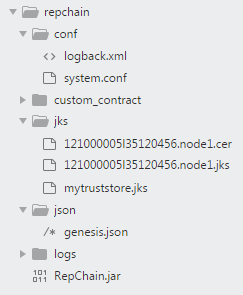

* **可能出现的问题**
  * leveldbjni相关的错误，在windows下可能是没有c++环境导致的，装[Microsoft Visual C++ 2010 x64 Redistributable](https://docs.microsoft.com/en-us/cpp/windows/latest-supported-vc-redist?view=msvc-170#visual-studio-2010-vc-100-sp1-no-longer-supported)即可
  * 出现节点加入网络失败的情况
    * 可能是防火墙或者端口(种子节点或者本节点)没开放，可以手动查看或者使用nmap扫描对应的端口
    * 可能是相应的节点证书没有放入到mytrustkeystore.jks，导致TLS连接失败
  * 磁盘空间不足的错误，有如下两个可能的原因：
    1. 确实是磁盘空间不足，修改system.conf中的配置项`diskspaceManager.diskspacealarm`
    2. 用户权限不够，即用户不具有在所配置存储目录下的读写的权限。

## 附录

### 创世块的构建

可使用RepChain自带的工具类来构建创世块，代码在`src/main/scala/rep.utils/GenesisBuilderMulti.scala`

### 节点密钥替换

默认为5节点，每个节点有一个密钥对，**实际**在生产环境部署RepChain需要更换开源仓库中的密钥，使用[KeyStoreExplorer](https://keystore-explorer.org/)（或者使用[代码](https://gitee.com/BTAJL/ToolCollection/blob/master/src/main/java/repchain/genjks/GenerateJks.java)）即可生成密钥对，导出证书

1. 为每个节点替换密钥，假设有5个节点，则使用**kse**生成5个包含密钥对（默认使用`secp256r1`）的`jks`并导出证书，更换`jks/`目录下的密钥与证书
2. 使用`kse`将各个节点的证书导入到`mytrustStore.jks`中
3. 使用`src/main/scala/rep.utils/GenesisBuilder.scala`或`src/main/scala/rep.utils/GenesisBuilderMulti`工具重新生成创世块

### 新增节点

!> 新增节点需要停机并重启网络

假设现在想增加组网节点，则需要生成新的`jks`，并放到`jks/`目录下，并且将证书导入到`mytrustStore.jks`中，所有节点的`mystruststore.jks`都需要更新

* 增加的是共识节点

  > 需要在配置文件中，将该节点配置到共识列表中，网络内所有节点需要**修改配置项**：`system.vote.vote_node_list`（配置项在conf/system.conf文件中）

* 增加的是同步节点

  > 更新网络内所有节点的`mytruststore.jks`，不用修改配置

<font color=#FF0000>需要注意的地方</font>：

1. 如果现在没有历史区块数据，则重构`genesis.json`，将新节点的账户与证书注册

2. 如果现在有历史数据，则无需重构`genesis.json`，可根据实际情况调用**账户证书管理合约**来注册账户或证书

   > 如果业务逻辑不涉及到新节点的账户，则该步骤非必须，因为默认`RepChain`会从`mytrustStore.jks`中加载所有节点的证书，可以保证新增节点所提交的签名交易能够被接受
