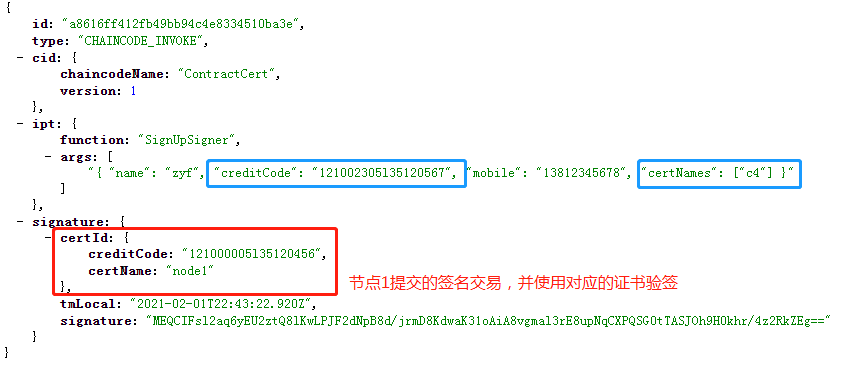
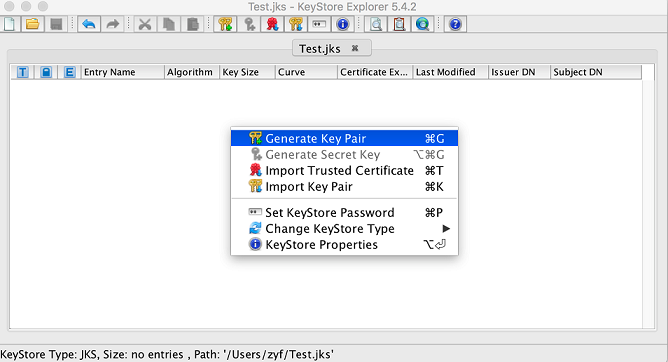
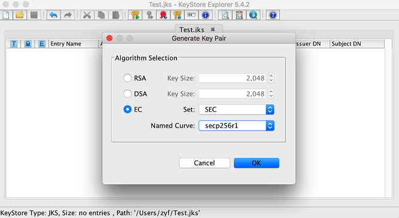
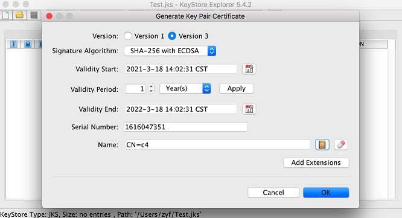
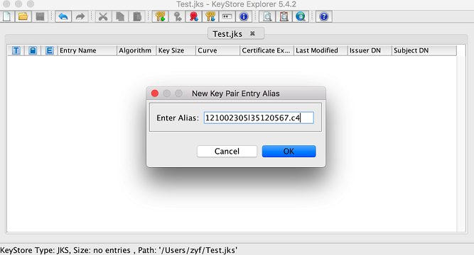
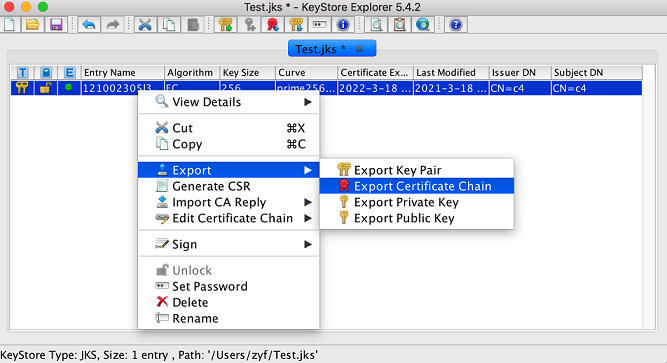
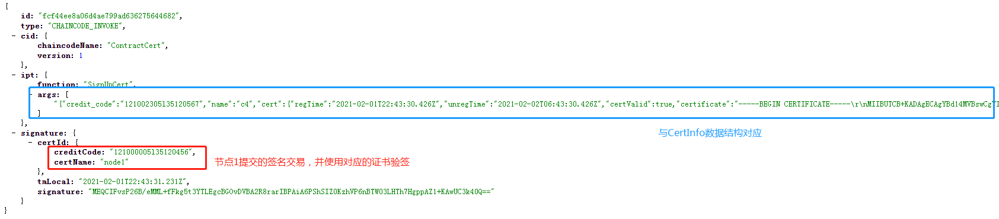
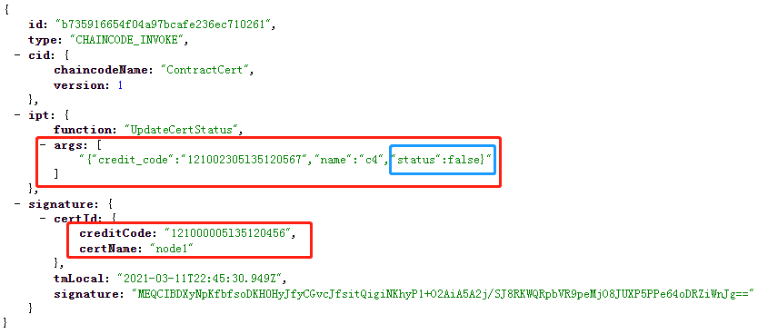
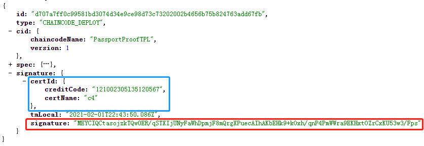

# 账户证书

?> `RepChain-V1.1.0`的账户证书管理是通过默认内置在创世块中的<u>**账户管理合约**</u>来管理的

## 账户注册

使用管理员（节点）密钥对构造签名交易，来SignUpSigner账户

账户的数据结构由protobuf定义，如下

```protobuf
message Signer {
    string name = 1; //注册者的名称或者昵称
    string credit_code = 2; //社会信用代码（个人或机构）或者DID，推荐使用DID
    string mobile = 3; // 手机号码,用于接收通知
    repeated string cert_names = 4; //存放用户所有证书的名称，用户具体的证书单独存放，方便证书的操作，用户在增加证书的时候，在这个列表中增加证书的名称
}
```

!> 其中creadit_code为信用号，假设为`"121000005l35120456"`，cert_names存放的是证书的别名（可存放多个别名，一个账户可持有多个证书），假设为`"node1"`，通过<u>**信用号+证书别名**</u>来检索用户对应的证书，签名交易中[certId](v1.1.0/contract.md#生命周期)就是为了检索对应的证书用来验证签名的

<b><font color=#ff000>下图为账户注册的签名交易：</font></b>



## 证书管理

### 密钥生成

用户自己使用代码或者工具来生成密钥即可，在v1.1.0版本中使用<b><font color=#ff00>secp256r1</font></b>曲线来生成密钥对（区别于v1.0.0版本的secp256k1），一般使用[kse](https://keystore-explorer.org/)（[KeyStoreExplorer](https://keystore-explorer.org/downloads.html)）或[openssl](https://www.openssl.org/)即可，生成密钥之后，将证书导出，为下一步证书注册做准备

下面以kse为例：

1. 生成密钥对



2. 选择曲线



3. 生成自签名证书



4. 为keypair设置alias



5. 导出证书



### 证书注册

使用管理员（节点）密钥对构造签名交易，来为普通用户注册证书

!> 1. 必须先注册账户，再注册证书<br>2. 同一个用户拥有一个账户，可拥有多个证书（在RepChain端通过<b><font color=#ff00>cert_name</font></b>来区分）

证书的数据结构由protobuf定义，如下

```protobuf
// 证书
message Certificate {
    string 	certificate = 1; //内含签发机构
    string 	alg_type = 2;//直接填写具体算法，如:ECDSA下的SHA1withECDSA,SHA512withECDSA等
    bool   	cert_valid = 3;//证书是否有效，true 有效；false 无效；protobuf默认该值为false
    google.protobuf.Timestamp reg_Time = 4; //注册时间
    google.protobuf.Timestamp unreg_Time = 5; //注销时间
}
```

注册证书的数据结构（**提交签名交易时，参数内容**）如下

```scala
case class CertInfo(credit_code: String, name: String, cert: Certificate)
```

!> 其中credit_code为账户id（注册账户时的id），其中name为证书别名（账户注册小节提到的），cert是上面protobuf定义的Certificate格式，其中包含的certificate字段是证书的pem格式字符串

<b><font color=#ff000>下图为注册证书的签名交易：</font></b>



### 证书禁用

**如果用户的密钥丢失，或者出于其他原因想要禁用证书**，那么通过向管理员申请说明之后，由管理员来提交禁用证书的签名交易，证书禁用后，对应的私钥构造的签名交易被提交到RepChain这边后，会验签失败

禁用证书的数据结构（**提交签名交易时，参数内容**）如下

```scala
case class CertStatus(credit_code: String, name: String, status: Boolean)
```

!> 其中credit_code为账户id（注册账户时的id），name为证书别名（即cert_name），status为证书状态，设置为**false**为禁用证书，**true**为启用证书

<b><font color=#ff000>下图为注册证书的签名交易：</font></b>



## 总结<!-- {docsify-ignore} -->

管理员为用户注册账户（如第一小节的例子`"121002305l35120567"`），并注册证书之后（如第二小节的例子`"c4"`），该用户就可以用被注册证书对应的私钥构建签名交易了，RepChain会根据<b><font color=#000ff>certId</font></b>来检索对应于<b><font color=#ff000>signature</font></b>的公钥证书



!> 1. 私钥签名，公钥验签，因此用户使用私钥签名，RepChain使用对应的公钥证书验签，所以**普通用户**先注册证书才能提交交易<br>2. 先注册账户，后才能注册证书<br>3. 管理员来管理普通用户的账户与证书